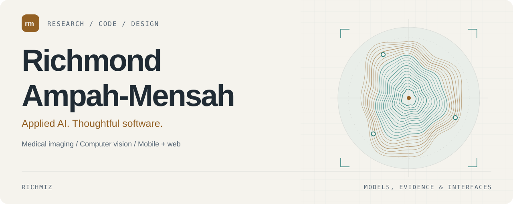
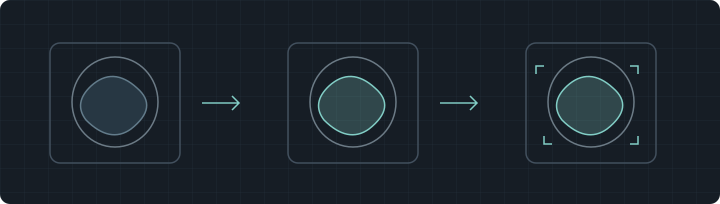
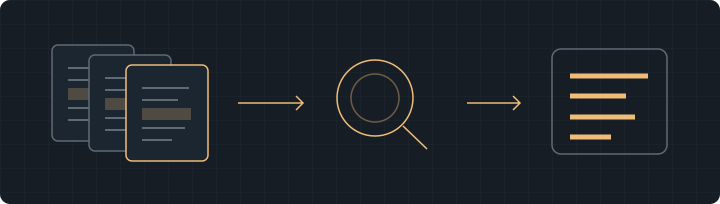

<picture>
  <source media="(prefers-color-scheme: dark) and (max-width: 600px)" srcset="assets/header-mobile-dark.svg">
  <source media="(prefers-color-scheme: light) and (max-width: 600px)" srcset="assets/header-mobile-light.svg">
  <source media="(prefers-color-scheme: dark)" srcset="assets/header-dark.svg">
  
</picture>

  <a href="#selected-work">Selected work</a> &nbsp; / &nbsp;
  <a href="#research-interests">Research interests</a> &nbsp; / &nbsp;
  <a href="https://www.linkedin.com/in/kofi-richmond">LinkedIn</a> &nbsp; / &nbsp;
  <a href="mailto:ampahmensahrich@gmail.com">Email</a>

## Hello, I'm Richmond.

I work across **applied AI research, medical imaging, and software development**. My projects explore how models interpret images and documents, how their behavior changes during adaptation and compression, and how to turn those capabilities into usable applications.

My research interests include medical image segmentation, radiomics, vision transformers, and reliable evaluation. Alongside that work, I build mobile and web applications with attention to the details people interact with: clear screens, dependable workflows, and thoughtful UI/UX.

## Selected work

### Medical image segmentation

**MedSAM-style adaptation, distillation, and compression.** Research code exploring LoRA adaptation of a segmentation teacher, a compact U-Net student, ONNX export, and INT8 evaluation against a predefined segmentation-quality threshold. The repository includes implementation code and lightweight experiment records.

MEDICAL IMAGING &nbsp; · &nbsp; PYTORCH &nbsp; · &nbsp; LORA &nbsp; · &nbsp; ONNX &nbsp; · &nbsp; QUANTIZATION

[Explore the research code →](https://github.com/Richmiz/Deployment-Gatted)

### Document evidence retrieval

**Understanding where document question answering succeeds and fails.** A controlled comparison of OCR-text, visual, and hybrid evidence retrieval on DocVQA and MP-DocVQA. The reproducibility package includes locked configurations, aggregate results, tests, and analysis separating retrieval errors from answer-generation errors.

DOCUMENT AI &nbsp; · &nbsp; MULTIMODAL RETRIEVAL &nbsp; · &nbsp; VISION-LANGUAGE MODELS &nbsp; · &nbsp; EVALUATION

[Explore the study and results →](https://github.com/Richmiz/docvqa-evidence-retrieval)

## Research interests

- **Medical imaging:** segmentation, radiomics, representation learning, and evaluation across devices and datasets.
- **Efficient vision models:** LoRA, knowledge distillation, quantization, and the accuracy/runtime trade-offs involved in deployment.
- **Document understanding:** OCR, visual retrieval, multimodal evidence, and failure analysis in question answering.
- **Reliable machine learning:** calibration, distribution shift, controlled comparisons, and reproducible experimental workflows.

## Tools I work with

| Area | Technologies and methods |
| :--- | :--- |
| AI and scientific computing | Python · PyTorch · TensorFlow · NumPy · pandas · scikit-learn |
| Vision and model adaptation | Hugging Face Transformers · CLIP · LoRA · knowledge distillation |
| Model export and runtime | ONNX · ONNX Runtime · TensorFlow Lite · quantization |
| Mobile applications | React Native · Expo · TypeScript |
| Web applications | React · Next.js · Node.js · Tailwind CSS · SQLite |
| Design and development | Figma · Adobe Illustrator · Git · Linux / WSL |

<b>A little more about how I work</b>

 

For research, I care about the split between development and evaluation, meaningful baselines, and records that make a result possible to inspect. I keep limitations close to the conclusions they affect.

For applications, I care about what happens beyond the first successful interaction: loading, missing information, retries, review, and recovery. I enjoy working through both the implementation and the interface.

## Let's connect

Interested in medical imaging, applied AI, or building a useful application? I'd be glad to compare ideas and discuss a project.

**[Email](mailto:ampahmensahrich@gmail.com)** &nbsp; · &nbsp; **[LinkedIn](https://www.linkedin.com/in/kofi-richmond)** &nbsp; · &nbsp; **[X](https://x.com/richmiz__)** &nbsp; · &nbsp; **[All repositories](https://github.com/Richmiz?tab=repositories)**

Richmond Ampah-Mensah · Research, code, and design.
