<picture>
  <source media="(prefers-color-scheme: dark)" srcset="assets/kinetic-hero-dark.svg">
  
</picture>

  <a href="#selected-work"><b>Explore my work</b></a> &nbsp; ✦ &nbsp;
  <a href="https://www.linkedin.com/in/kofi-richmond"><b>LinkedIn</b></a> &nbsp; ✦ &nbsp;
  <a href="https://orcid.org/0009-0007-2124-3262"><b>ORCID</b></a> &nbsp; ✦ &nbsp;
  <a href="mailto:ampahmensahrich@gmail.com"><b>Get in touch ↗</b></a>

### A researcher’s curiosity. A developer’s attention to detail.

I'm **Richmond**, an applied AI researcher and software developer working across **medical imaging, computer vision, and document understanding**. I explore how models learn visual representations, what happens when we adapt or compress them, and how to evaluate the results carefully.

I also build **mobile and web applications**, from the interface people touch to the workflows behind it. My work connects experiments, implementation, and design.

## Selected work

<a href="https://github.com/Richmiz/Deployment-Gatted">
  <picture>
    <source media="(prefers-color-scheme: dark)" srcset="assets/kinetic-med-dark.svg">
    
  </picture>
</a>

**How much can we compress a segmentation model before its quality changes?** This research code explores a MedSAM-style teacher, LoRA adaptation, a compact U-Net student, and INT8 evaluation against a predefined quality threshold. Includes implementation code and lightweight experiment records.

[**Explore medical imaging research ↗**](https://github.com/Richmiz/Deployment-Gatted)

 

<a href="https://github.com/Richmiz/docvqa-evidence-retrieval">
  <picture>
    <source media="(prefers-color-scheme: dark)" srcset="assets/kinetic-doc-dark.svg">
    
  </picture>
</a>

**Was the evidence missed, or did the answer generator get it wrong?** A controlled comparison of OCR-text, visual, and hybrid retrieval on DocVQA and MP-DocVQA. Locked configurations, aggregate results, and failure analysis make the experiments inspectable.

[**Explore the study and results ↗**](https://github.com/Richmiz/docvqa-evidence-retrieval)

## Questions that drive my research

| Focus | What I explore |
| :--- | :--- |
| **Medical imaging** | Segmentation, radiomics, and useful visual representations across datasets. |
| **Efficient computer vision** | What LoRA, distillation, and quantization preserve—and what they change. |
| **Document intelligence** | How text and visual evidence support answers to document questions. |
| **Reliable machine learning** | Calibration, distribution shift, and evaluation that exposes limitations. |

## From experiments to applications

<picture>
  <source media="(prefers-color-scheme: dark)" srcset="assets/kinetic-stack-dark.svg">
  
</picture>

<b>Open the toolbox ↓</b>

 

| Area | Tools and methods |
| :--- | :--- |
| AI and scientific computing | Python · PyTorch · TensorFlow · NumPy · pandas · scikit-learn |
| Vision and adaptation | Hugging Face Transformers · CLIP · LoRA · knowledge distillation |
| Export and inference | ONNX · ONNX Runtime · TensorFlow Lite · quantization |
| Mobile | React Native · Expo · TypeScript |
| Web | React · Next.js · Node.js · Tailwind CSS · SQLite |
| Design and development | Figma · Adobe Illustrator · Git · Linux / WSL |

<b>How I approach the work ↓</b>

 

**For research:** meaningful baselines, a clear separation between development and evaluation, and records that let someone inspect a result. Limitations belong beside the conclusions they affect.

**For software:** clear interfaces and attention to loading, missing information, retries, and recovery. The details after the first successful interaction matter.

 

<a href="mailto:ampahmensahrich@gmail.com">
  <picture>
    <source media="(prefers-color-scheme: dark)" srcset="assets/kinetic-footer-dark.svg">
    
  </picture>
</a>

  <a href="mailto:ampahmensahrich@gmail.com">Email</a> &nbsp; / &nbsp;
  <a href="https://www.linkedin.com/in/kofi-richmond">LinkedIn</a> &nbsp; / &nbsp;
  <a href="https://x.com/richmiz__">X</a> &nbsp; / &nbsp;
  <a href="https://github.com/Richmiz?tab=repositories">All repositories</a>

Richmond Ampah-Mensah · Research, code, and design. Original animated SVG artwork. Illustrations are conceptual.

